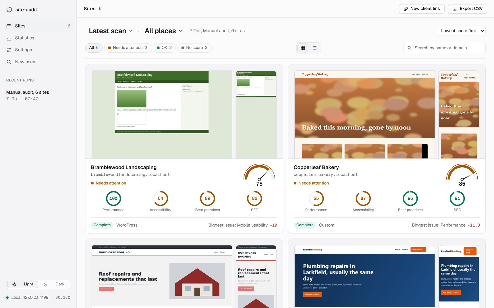
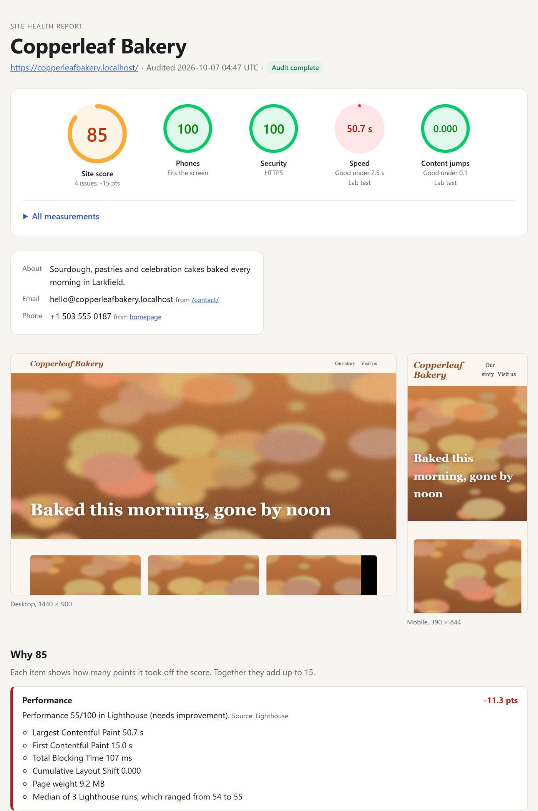
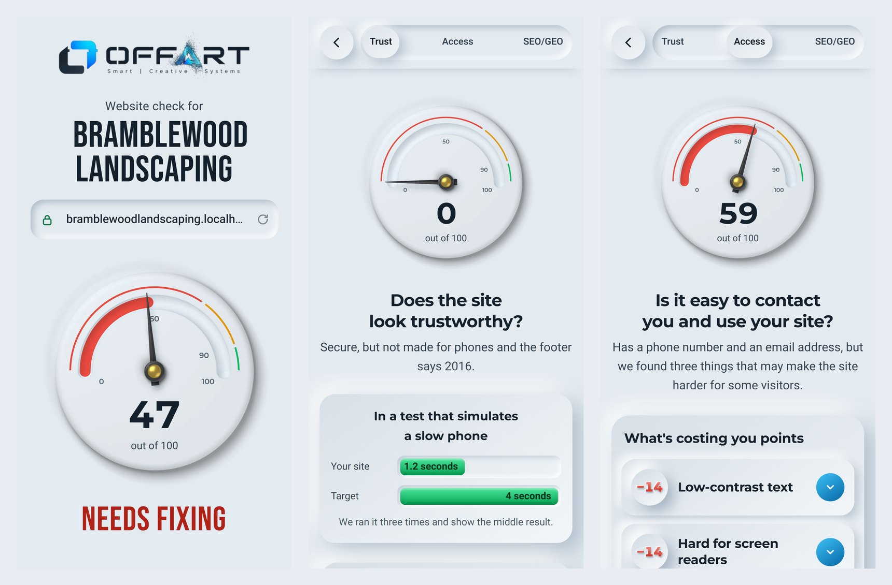
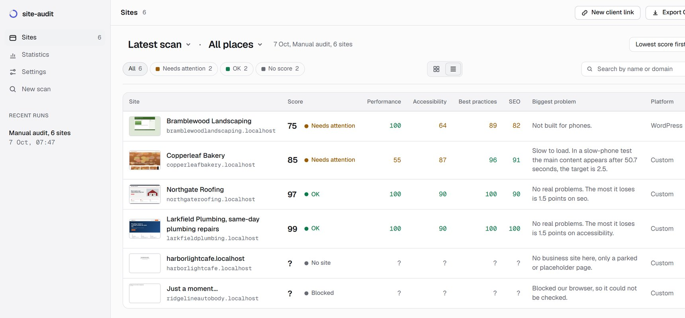
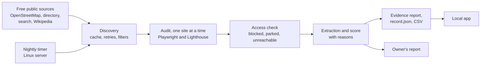

# Website Audit Pipeline

A pipeline that finds small business websites from free public sources, audits each one in a real browser, and turns what it measured into a health score with reasons, an evidence report per site, a plain report for the business owner and a CSV summary. It runs every night on a Linux server. It finds, checks and reports, and never sends email or contacts anyone.

Solo project.

**Every screenshot here comes from a real run of the pipeline on invented businesses served on my own computer.** No real business, domain, phone or email appears on this page.

**Highlights**

- Collection built for real small business sites, with one check at a time on each site and a hard time limit per site. A bot check, a parked domain or a dead host is recorded as what it is, never scored and never pushed past.
- No number without a measurement. A check that fails is listed as not measured, a site with less than half of its score measured gets no score, and every lost point names the check behind it.
- Runs unattended. A nightly job on a Linux server finds and audits new sites until its time is up and alerts me when a night fails or finds nothing, and a daily task brings the results home.

## What each site is checked for

Each site is opened on a desktop and on a phone, and seven parts make a health score from 0 to 100.

| Part | How it is measured |
|---|---|
| Speed | Real Chrome visitors on phones when Chrome has data for the site, otherwise Lighthouse on an emulated slow phone, the median of three runs |
| Phones | My own render at 390 pixels, the viewport tag and sideways scrolling |
| SEO | Lighthouse |
| Accessibility | Lighthouse |
| Best practices | Lighthouse |
| Code age | Old jQuery or Bootstrap, an old CMS version, outdated tags, table layout, a footer copyright more than three years old |
| HTTPS | The final address after redirects, and a valid certificate |

A site without HTTPS, or with a broken certificate, cannot score high however good the rest is, so an average cannot hide what every visitor sees first. The audit also reads how the site shows up to search engines and AI search, for example whether its robots.txt shuts out AI crawlers.

Every site gets an evidence report with the score, the business's description in its own words, the email and phone it publishes with the page each was found on, both screenshots, and every lost point with what was measured. The points lost add up to 100 minus the score. Next to it, a `record.json` keeps every measurement for other tools.

## What the business owner gets

A separate report for the owner, in plain words, in English and in Hebrew, which can be shared as a link on my website. It turns the measurements into three questions, does the site look trustworthy, is it easy to contact you and use the site, and can people find you on Google and in AI search, scored from fixed checks with fixed points, so the owner gets a score of its own while the seven-part score stays inside the tool. Each question opens to what is costing points and what already works. The findings come from Lighthouse and from my own checks, and each of my own checks is measured against the gold set described below before it reaches this report.

## Collection

### A visitor, not an attack

Some hosts block a browser that announces itself as HeadlessChrome, so the browser presents a regular Chrome user agent that matches the engine it really runs. On one bot-protected host, Lighthouse on the installed Chrome got HTTP 403 on every run while Playwright's Chromium loaded the page, so Lighthouse runs on that same Chromium. Checks on a site run one after another, and sites are audited one at a time, so a small site's protection does not see a burst of parallel requests. A site that still answers with a bot check, 401, 403 or 429 is recorded as blocked and left alone.

Noise gets a status of its own instead of a score. A parked domain, a host's default page, a coming-soon page or a soft 404 is recorded as no site, a domain that forwards to a social profile as redirected, and a dead address as unreachable.

### A hard limit for every site

Some pages never go quiet, because chat widgets and analytics beacons keep the network busy. One homepage arrived in a second and was ready only after more than 30 seconds, so a 30-second limit had called a working site unreachable. The homepage now has one limit to arrive and a longer one to be ready, and every site has a hard limit of 240 seconds. When it runs out, every browser context and the Lighthouse Chrome that the site opened are closed, so one bad site cannot stall a night. A slow site gets fewer Lighthouse runs instead of none.

### Finding sites worth checking

Discovery draws on four free public sources, OpenStreetMap through the Overpass API, a business directory, web search and Wikipedia. Overpass is a shared public server, so each query is small, answers are cached for a day, there is a pause between queries, and a busy server is retried after a wait instead of given up on. Directories, marketplaces, social profiles, government domains and chains are filtered out, duplicates are removed by domain, and a repeat scan of an area skips sites already audited.

## Quality

**A failed check is not a score.** When Lighthouse cannot load a page it still returns a report, with the reason inside and every score empty. The pipeline reads that reason and records a failed check with its HTTP status, never empty scores that look valid. Lab speed moves between runs, so Lighthouse runs three times, the median run is kept and the spread is reported.

**Extraction without a model.** Phones are validated with libphonenumber rather than a regex, `tel:` links and structured data come first, emails are never taken from scripts or styles, and the description is quoted, not rewritten.

**Old records stay comparable.** Every record is scored again from its saved measurements when it is read, so a comparison over time compares the same thing even after the rules change.

**My checks measured against hand labels.** Every check of my own that can reach a business owner is measured against a set of sites I labelled by hand, and it needs 95% precision over at least five positive cases first. The gold check fails when a check that passed falls below that, so a rule change cannot quietly make a client sentence wrong. It has already moved three checks out of client reports after they proved wrong on modern site builders.

## How it is checked

- **522 tests** with `node --test` in 41 files, on discovery, access classification, scoring, extraction, reports, the app server and the nightly run. 521 passed, 1 skipped and none failed on 7 October 2026.
- **A gold set** of hand-labelled sites for every check of my own that reaches a business owner.
- **The nightly job** has run unattended every night since 4 October 2026.

## Architecture

It runs from the command line, as `discover`, `audit`, `scan` and `nightly`, and as a local app for browsing results, comparing a site over time and running a scan with live progress.

## Stack

Node.js, Playwright with Chromium, Lighthouse as a library, Chrome UX Report API, cheerio, libphonenumber-js, Commander, Server-Sent Events, vanilla JavaScript, node:test, systemd.

## Source code

The code lives in a private repository. A private code review is available to hiring teams by arrangement.

Meir Mizrahi, [offart.space](https://offart.space), meir@offart.space
